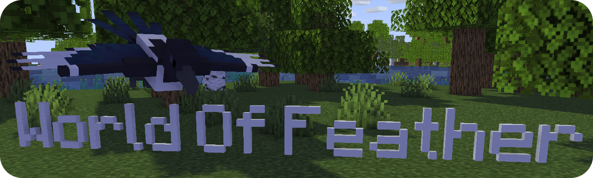
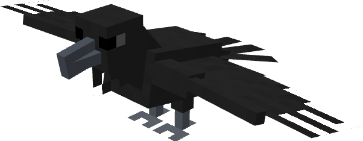

Minecraft birds mod     
Available on [CurseForge](https://www.curseforge.com/minecraft/mc-mods/yarabirds/files) and [GitHub](https://github.com/Neisvestney/YaraBirds/releases)   
**Requires 
[Fabric Loader](https://fabricmc.net/use/installer/),
[Fabric Api](https://www.curseforge.com/minecraft/mc-mods/fabric-api) and
[GeckoLib](https://www.curseforge.com/minecraft/mc-mods/geckolib)**

## Features:
- Added new mobs with custom AI, models and animations:
  - Hooded crow  
  

  - Magpie  
  

  - Raven  
  
- Added natural spawn of these mobs
- Added spawn eggs

## Creators
- [Neisvestney](https://github.com/Neisvestney) (Code)
- [Настя Климова](https://www.youtube.com/c/%D0%9D%D0%B0%D1%81%D1%82%D1%8F%D0%9A%D0%BB%D0%B8%D0%BC%D0%BE%D0%B2%D0%B0) (Models)
